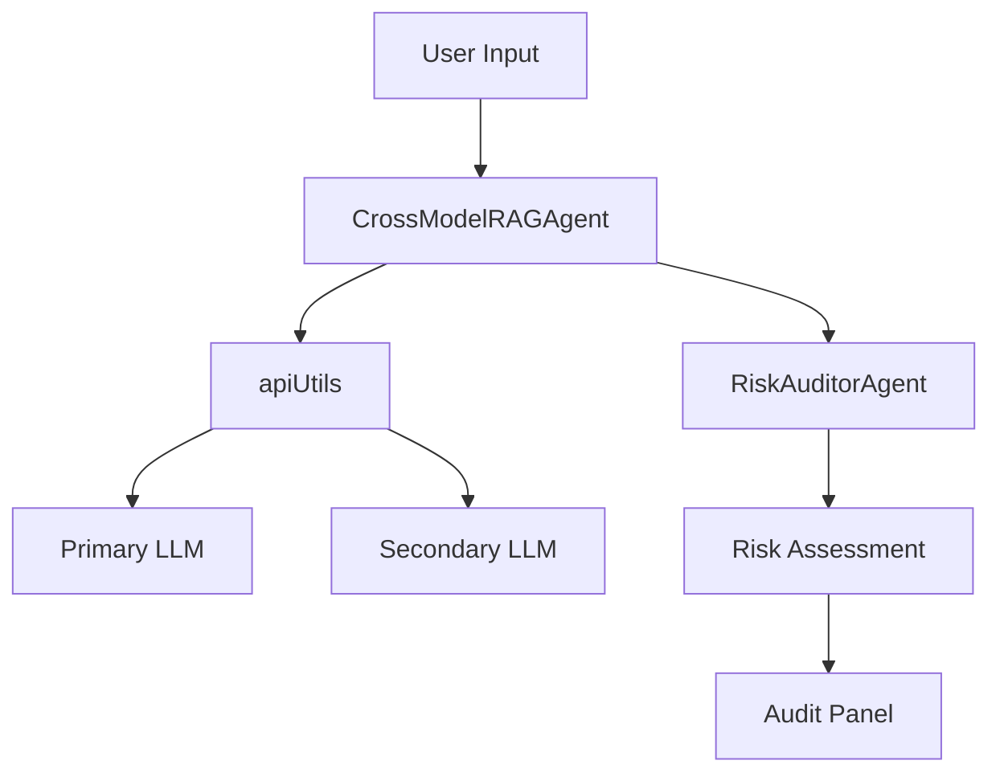

# ModelProof

ModelProof is a multi-model validation and LLM safety auditing system designed to ensure trustworthy AI interactions. It verifies language model responses across multiple sources and audits them for risk, bias, hallucination, and alignment issues using a real-time, agent-driven approach.

##  Features

- **Multi-Model Validation**: Simultaneously query two or more large language models (LLMs) and cross-check their responses for consistency
- **Intent Alignment Auditing**: Evaluates whether the assistant's responses across the entire conversation align with the user's intent
- **Risk Analysis by Response**: Each assistant response is audited individually for hallucination, bias, and toxicity
- **Real-Time Audit Panel**: View detailed breakdowns of safety risks, alignment explanations, and flagged content
- **Extensible Agent Framework**: Supports modular expansion for additional models or audit agents
- **Fallback Safety**: Built-in fallback and retry logic to recover from model or API outages

##  Architecture

The system consists of three main components:

1. **CrossModelRAGAgent**: Queries multiple LLMs and validates their responses against each other
2. **RiskAuditorAgent**: Evaluates text for hallucination, bias, toxicity, and intent alignment
3. **apiUtils**: Manages API communication with LLM providers with built-in fallback mechanisms

### Component Interaction



## Tech Stack

- **Frontend**: React, TypeScript, Tailwind CSS
- **Backend**: Node.js, TypeScript
- **APIs**: GitHub AI, HuggingFace (extensible to other providers)
- **Build Tools**: Vite, npm

## Installation

1. Clone the repository:
   ```bash
   git clone https://github.com/hgenix20/modelproof.git
   cd modelproof
   ```

2. Install dependencies:
   ```bash
   npm install
   ```

3. Create a `.env` file in the root directory:
   ```env
   VITE_GITHUB_TOKEN=my_github_api_token
   VITE_API_ENDPOINT=https://models.github.ai/inference
   VITE_HUGGINGFACE_TOKEN=my_huggingface_api_token
   ```

4. Start the development server:
   ```bash
   npm run dev
   ```

##  Configuration

The system can be configured through environment variables and the `config` object:

```typescript
const config = {
  models: {
    MAI: {
      github: "meta/Meta-Llama-3-8B-Instruct",
      huggingface: "meta-llama/Meta-Llama-3-8B-Instruct"
    },
    phi35: {
      github: "microsoft/phi-3-mini-128k-instruct",
      huggingface: "microsoft/phi-3-mini-128k-instruct"
    },
    openai: {
      github: "ai21-labs/AI21-Jamba-1.5-Large",
      huggingface: "ai21-labs/AI21-Jamba-1.5-Large"
    }
  },
  similarityThreshold: 0.8,
  maxRetries: 3,
  fallbackModel: "phi35"
};
```

##  Safety Assessment Metrics

The system evaluates four key metrics:

1. **Hallucination Score**: Measures factual accuracy and confidence
2. **Bias Score**: Identifies potential biases and stereotypes
3. **Toxicity Score**: Assesses harmful or inappropriate content
4. **Intent Alignment Score**: Measures how well responses align with user intent

##  Security

### API Tokens and Environment Variables

The project uses environment variables to securely store API tokens and sensitive configuration. Never commit these values to version control.

1. Create a `.env` file in the root directory with the following structure:
   ```env
   VITE_GITHUB_TOKEN=my_github_api_token
   VITE_API_ENDPOINT=https://models.github.ai/inference
   VITE_HUGGINGFACE_TOKEN=my_huggingface_api_token
   ```

2. The `.gitignore` file is configured to exclude:
   - All `.env` files
   - Environment-specific files
   - Build artifacts
   - Dependencies
   - Editor configurations

### Security Best Practices

- Never commit API tokens or secrets to version control
- Use environment variables for all sensitive configuration
- Rotate API tokens regularly
- Keep dependencies updated to patch security vulnerabilities
- Review the `.gitignore` file to ensure sensitive files are excluded

##  Contributing

1. Fork the repository
2. Create your feature branch (`git checkout -b feature/amazing-feature`)
3. Commit your changes (`git commit -m 'Add some amazing feature'`)
4. Push to the branch (`git push origin feature/amazing-feature`)
5. Open a Pull Request

##  License

This project is licensed under the MIT License - see the [LICENSE](LICENSE) file for details.

##  Acknowledgments

- Meta for Llama models
- Microsoft for Phi models
- AI21 Labs for Jamba models
- The open-source community for various tools and libraries

##  Contact

For questions or support, please open an issue in the repository.

---

Built for the AI Agents Hackathon 2025
