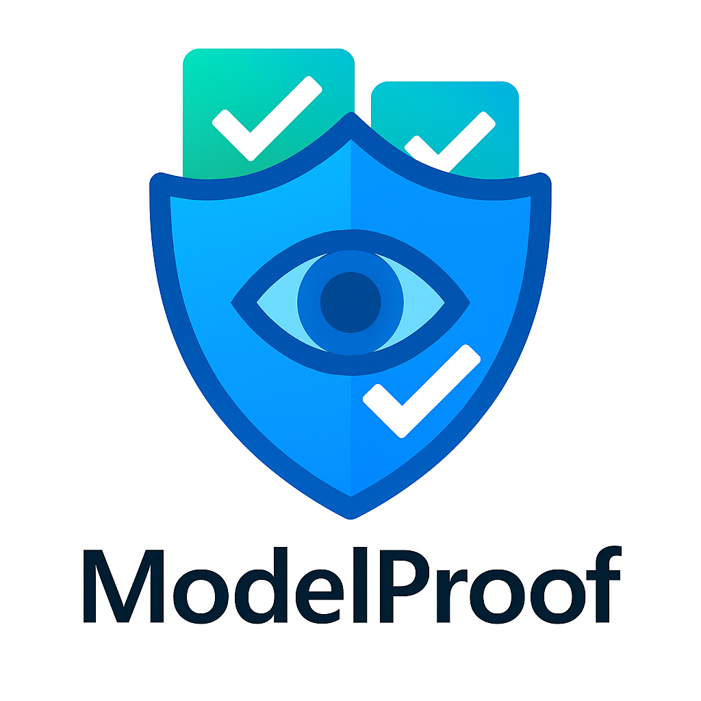
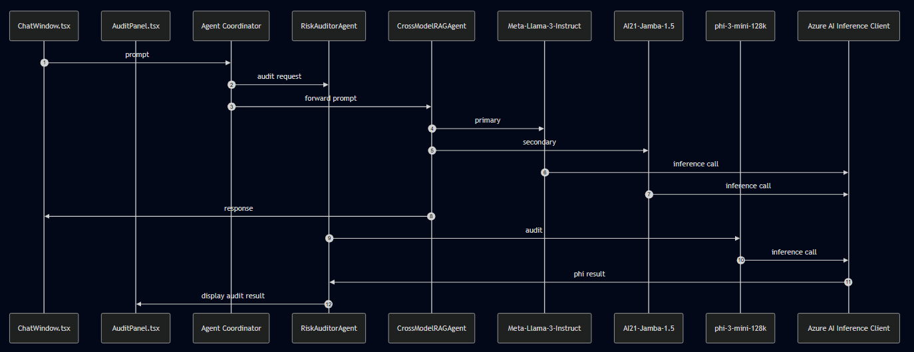
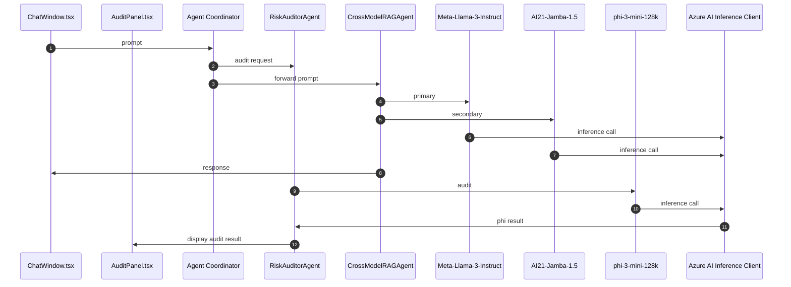

# ModelProof: Sentinel AI Chat

[](src/assets/ModelProof.png)

> **Hackathon Category:** Javascript/Typescript 
> **Demo Video (≤ 5 min):** [Watch on YouTube](https://youtu.be/qPX_TDM4DSE)  

ModelProof is a real-time, agent-driven AI chat system that cross-validates responses from multiple large language models and performs safety audits on each reply, flagging hallucinations, bias, toxicity, and misalignment. Built with modular agents, it delivers trustworthy AI interactions out of the box.

---

## 🏆 Award

**Microsoft AI Agents Hackathon 2025 — JavaScript/TypeScript Category Winner**

ModelProof was recognized as a category winner in the [Microsoft AI Agents Hackathon 2025](https://techcommunity.microsoft.com/blog/azuredevcommunityblog/ai-agents-hackathon-2025-%E2%80%93-category-winners-showcase/4415088). The official submission is on record at [issue #517](https://github.com/microsoft/AI_Agents_Hackathon/issues/517).

📄 [Winners Showcase (PDF)](./AI%20Agents%20Hackathon%202025%20-%20Category%20Winners%20Showcase.pdf)

---

## Features

- **Multi-Model Validation**  
  Query two LLMs in parallel (Meta-Llama-3 & AI21-Jamba-1.5), compare confidence and similarity, and automatically select the best answer or present both when divergent.  
- **Risk Analysis by Response**  
  Audit every response for hallucination, bias, toxicity, and intent alignment using the RiskAuditorAgent.  
- **Real-Time Audit Panel**  
  Color-coded ✅/⚠️/❌ indicators with scores and detailed explanations, all updated live as tokens stream in.  
- **Agentic Framework**  
  Clear separation of concerns:  
  1. **CrossModelRAGAgent** handles multi-model queries and validation  
  2. **RiskAuditorAgent** performs safety auditing  
  3. **Coordinator** orchestrates fallbacks, retries, and UI integration  
- **Built-In Fallbacks**  
  Automatically retry with alternate providers (GitHub AI → HuggingFace Gradio) on rate limits or failures.  
- **Extensible & Configurable**  
  Easily swap in new models or add custom audit agents via a unified `ModelResponse` interface.

---

## Architecture

High-level component diagram:
[](src/assets/ModelProof-Sequence-Diagram.png)


## Tech Stack

- **Frontend**: React, TypeScript, Tailwind CSS
- **Backend**: Node.js, TypeScript
- **AI Inference**: Azure AI Client (Streaming), HuggingFace Gradio Client
- **CI/CD**: GitHub Actions
- **APIs**: GitHub AI, HuggingFace
- **Build Tools**: Vite, npm
- **Diagramming**: Mermaid

## Installation

1. Clone the repository:
   ```bash
   git clone https://github.com/hgenix20/modelproof.git
   cd modelproof
   ```

2. Install dependencies:
   ```bash
   npm install
   ```

3. Create a `.env` file in the root directory:
   ```env
   VITE_GITHUB_TOKEN=my_github_api_token
   VITE_API_ENDPOINT=https://models.github.ai/inference
   VITE_HUGGINGFACE_TOKEN=my_huggingface_api_token
   ```

4. Run locally:
   ```bash
   npm run dev
   ```

5. Build for production:
   ```bash
   npm run build
   npm run preview
   ```

##  Configuration

The system can be configured through environment variables and the `config` object:

```typescript
export const config = {
  similarityThreshold: 0.8,
  maxRetries: 3,
  models: {
    MAI: {
      github: "meta/Meta-Llama-3-8B-Instruct",
      huggingface: "meta-llama/Meta-Llama-3-8B-Instruct"
    },
    JMB: {
      github: "ai21-labs/AI21-Jamba-1.5-Large",
      huggingface: "ai21-labs/AI21-Jamba-1.5-Large"
    },
    PHI: {
      github: "microsoft/phi-3-mini-128k-instruct",
      huggingface: "microsoft/phi-3-mini-128k-instruct"
    }
  }
};
```

##  Safety Assessment Metrics

The system evaluates four key metrics:

1. **Hallucination Score**: Measures factual accuracy and confidence
2. **Bias Score**: Identifies potential biases and stereotypes
3. **Toxicity Score**: Assesses harmful or inappropriate content
4. **Intent Alignment Score**: Measures how well responses align with user intent

### Security Best Practices

- Never commit API tokens or secrets to version control
- Use environment variables for all sensitive configuration
- Rotate API tokens regularly
- Keep dependencies updated to patch security vulnerabilities
- Review the `.gitignore` file to ensure sensitive files are excluded

##  Contributing

1. Fork the repository
2. Create your feature branch (`git checkout -b feature/amazing-feature`)
3. Commit your changes (`git commit -m 'Add some amazing feature'`)
4. Push to the branch (`git push origin feature/amazing-feature`)
5. Open a Pull Request

##  License

This project is licensed under the MIT License - see the [LICENSE](LICENSE) file for details.

##  Acknowledgments

- Meta for Llama models
- AI21 Labs for Jamba models
- Microsoft for Phi models & Azure AI Inference
- The open-source community for various tools and libraries

##  Contact

For questions or support, please open an issue in the repository.

---

Built for the AI Agents Hackathon 2025
